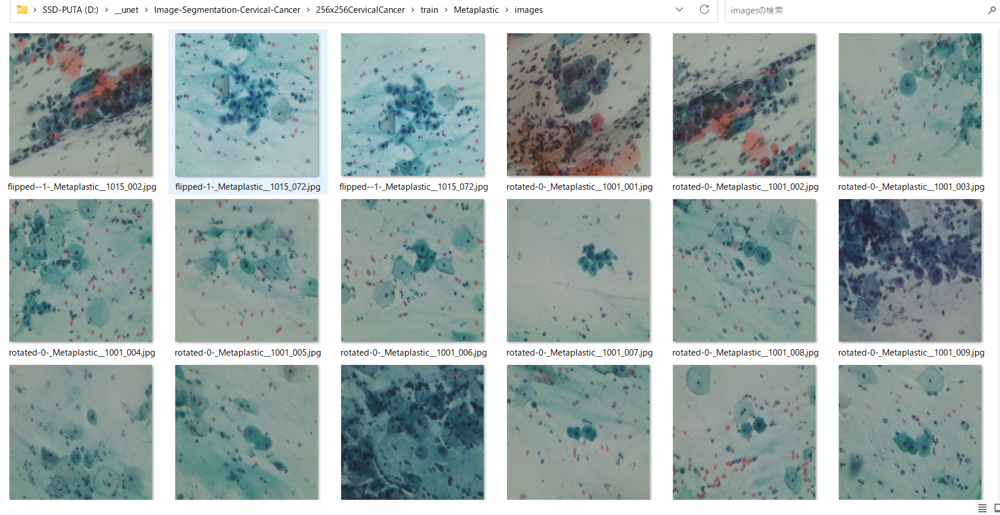
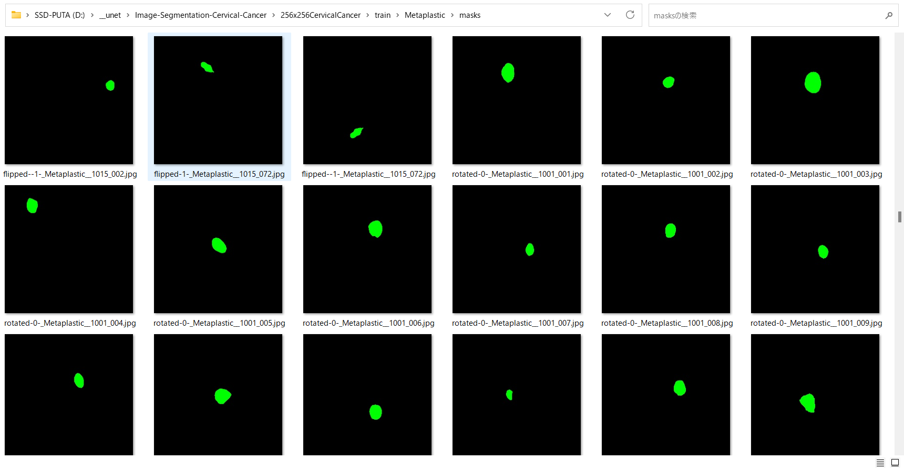
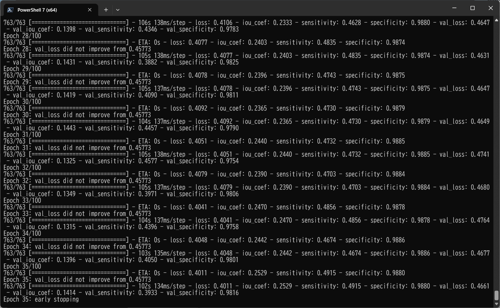
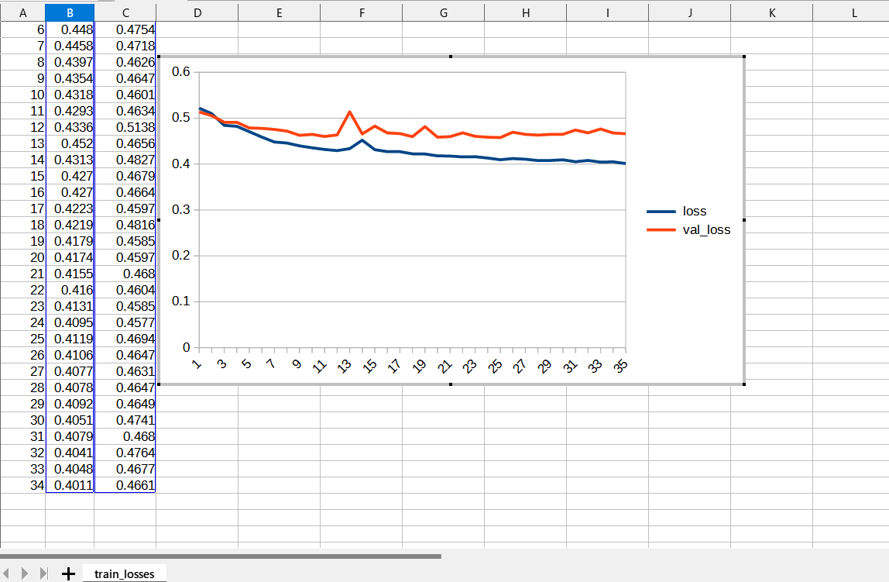
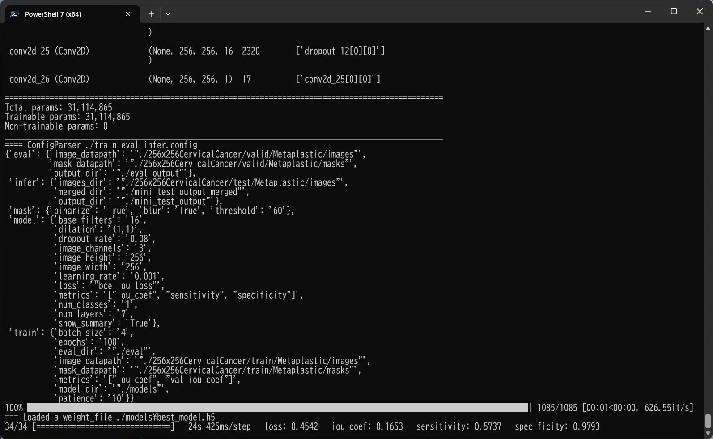
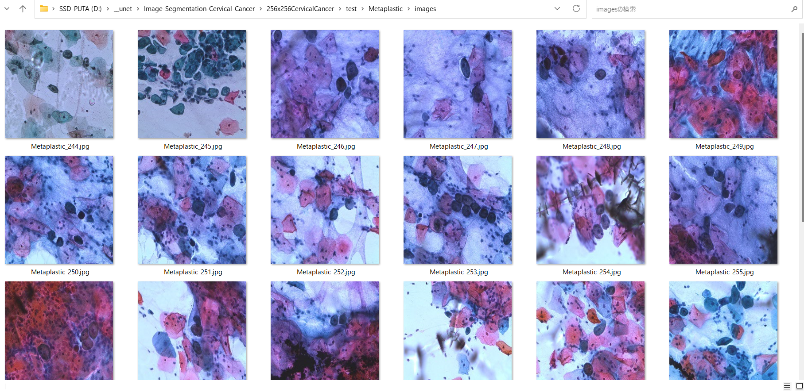
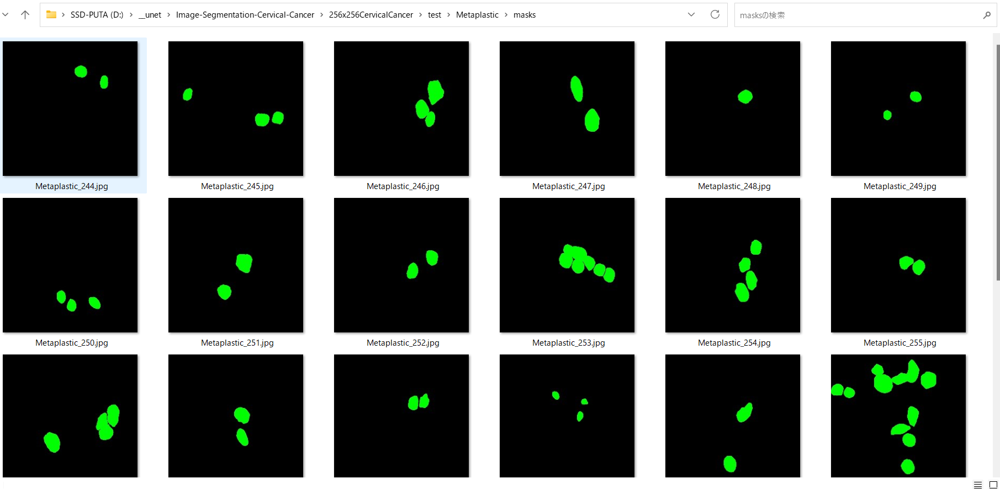
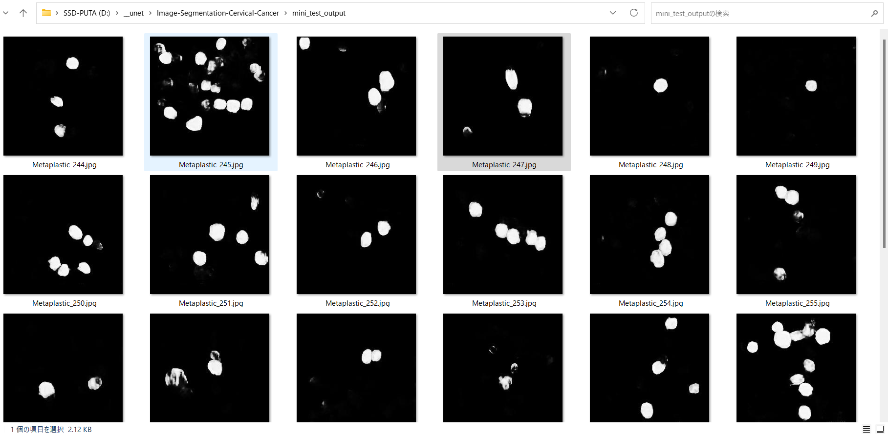

# Image-Segmentation-Cervical-Cancer (Updated: 2023/06/07)
<h2>
1 Image-Segmentation-Cervical-Cancer
</h2>

This is an experimental project for Image-Segmentation of Cervical-Cancer by using
our <a href="https://github.com/atlan-antillia/Tensorflow-Slightly-Flexible-UNet">Tensorflow-Slightly-Flexible-UNet</a> Model.
 

The image dataset used here has been taken from the following web site.

<pre>
Cervical Cancer largest dataset (SipakMed)
https://www.kaggle.com/datasets/prahladmehandiratta/cervical-cancer-largest-dataset-sipakmed
</pre>
<b>About Dataset</b> 
<pre>
Please don't forget to upvote if you find this useful.
Context
Cervical cancer is the fourth most common cancer among women in the world, estimated more than 0.53 million 
women are diagnosed in every year but more than 0.28 million women’s lives are taken by cervical cancer 
in every years . Detection of the cervical cancer cell has played a very important role in clinical practice.

Content
The SIPaKMeD Database consists of 4049 images of isolated cells that have been manually cropped from 966 cluster
 cell images of Pap smear slides. These images were acquired through a CCD camera adapted to an optical microscope. 
 The cell images are divided into five categories containing normal, abnormal and benign cells.

Acknowledgements
IEEE International Conference on Image Processing (ICIP) 2018, Athens, Greece, 7-10 October 2018.

Inspiration
CERVICAL Cancer is an increasing health problem and an important cause of mortality in women worldwide. 
Cervical cancer is a cancer is grow in the tissue of the cervix . It is due to the abnormal growth of cell that 
are spread to the other part of the body.
Automatic detection technique are used for cervical abnormality to detect Precancerous cell or cancerous cell 
than no pathologist are required for manually detection process.
</pre>

See also:

<pre>
U-Net: Convolutional Networks for Biomedical Image Segmentation
 https://arxiv.org/pdf/1505.04597.pdf
</pre>

 
<h2>
2 Prepare dataset
</h2>

<h3>
2.1 Download master dataset
</h3>
 Please download the original dataset from the following link 
<pre>
Cervical Cancer largest dataset (SipakMed)
https://www.kaggle.com/datasets/prahladmehandiratta/cervical-cancer-largest-dataset-sipakmed
</pre>
</pre>
The dataset has the following folder structure. 
<pre>
├─im_Dyskeratotic
│  └─im_Dyskeratotic
│      └─CROPPED
├─im_Koilocytotic
│  └─im_Koilocytotic
│      └─CROPPED
├─im_Metaplastic
│  └─im_Metaplastic
│      └─CROPPED
├─im_Parabasal
│  └─im_Parabasal
│      └─CROPPED
└─im_Superficial-Intermediate
    └─im_Superficial-Intermediate
        └─CROPPED 
</pre>

<h3>
2.2 Prepare dataset
</h3>
By using Python script <a href="./256x256ImageMaskDatasetGenerator.py">256x256ImageMaskDatasetGenerator.py</a>, we have created <b>256X256CervicalCancer</b> dataset from the original image bmp files and mask data files
in the <b>SipakMed</b> dataset. 
The script performs the following image processings. 
<pre>
1 Resize all bmp files to 256x256 square jpg files
2 Create 256x256 square mask jpg files corresponding to image files from <b>*_cyt*.dat</b> files.
3 Create rotated and flipped image and mask files to augment the orginal image and mask files.
</pre>
We have not used images and *.dat files in <b>CROPPED</b> folders to create images and masks dataset for 
Tensorflow-Slightly-Flexible-UNet Model.  
The created <b>256X256CervicalCancer</b> dataset has the following folder structure. 
<pre>
./256X256CervicalCancer
├─test
│  ├─Dyskeratotic
│  │  ├─images
│  │  └─masks
│  ├─Koilocytotic
│  │  ├─images
│  │  └─masks
│  ├─Metaplastic
│  │  ├─images
│  │  └─masks
│  └─Parabasal
│      ├─images
│      └─masks
├─train
│  ├─Dyskeratotic
│  │  ├─images
│  │  └─masks
│  ├─Koilocytotic
│  │  ├─images
│  │  └─masks
│  ├─Metaplastic
│  │  ├─images
│  │  └─masks
│  └─Parabasal
│      ├─images
│      └─masks
└─valid
    ├─Dyskeratotic
    │  ├─images
    │  └─masks
    ├─Koilocytotic
    │  ├─images
    │  └─masks
    ├─Metaplastic
    │  ├─images
    │  └─masks
    └─Parabasal
        ├─images
        └─masks
</pre>

Fo simplicity, we will deal with only <b>Metaplastic</b> category.
 
<b>Train_Metaplastic_images_sample</b> 

 
<b>Train_Metaplastic_masks_sample</b> 

 

<h2>
3 Train TensorflowUNet Model
</h2>
 We have trained Cervical-Cancer TensorflowUNet Model by using the following
 <b>train_eval_infer.config</b> file.  
Please run the following bat file. 
<pre>
>1.train.bat
</pre>
, which simply runs the following command. 
<pre>
>python TensorflowUNetTrainer.py
</pre>

<pre>
;
; train_eval_infer.config
; for Tensorflow-Attention-UNet
; 2023/06/06 antillia.com
; Modified to use loss and metric
; Specify loss as a function nams
; loss =  "binary_crossentropy"
; Specify metrics as a list of function name
; metrics = ["binary_accuracy"]
; Please see: https://www.tensorflow.org/api_docs/python/tf/keras/Model?version=stable#compile

[model]
image_width    = 256
image_height   = 256
image_channels = 3
num_classes    = 1
base_filters   = 16
num_layers     = 7
dropout_rate   = 0.08
learning_rate  = 0.001
dilation       = (1,1)
loss           = "bce_iou_loss"
metrics        = ["iou_coef", "sensitivity", "specificity"]
show_summary   = True

[train]
epochs        = 100
batch_size    = 4
patience      = 10
metrics       = ["iou_coef", "val_iou_coef"]
model_dir     = "./models"
eval_dir      = "./eval"
image_datapath = "./256x256CervicalCancer/train/Metaplastic/images"
mask_datapath  = "./256x256CervicalCancer/train/Metaplastic/masks"

[eval]
image_datapath = "./256x256CervicalCancer/valid/Metaplastic/images"
mask_datapath  = "./256x256CervicalCancer/valid/Metaplastic/masks"
output_dir     = "./eval_output"

[infer] 
images_dir    = "./256x256CervicalCancer/test/Metaplastic/images" 
output_dir = "./mini_test_output"
merged_dir = "./mini_test_output_merged"

[mask]
blur      = True
binarize  = True
threshold = 60

</pre>

Since 
<pre>
loss = "bce_iou_loss" 
</pre> 
, which stands for a mixed loss function of "binary crossentroy loss" and "intersection over union loss", 
and <pre>metrics = ["iou_coef", "sensitivity", "specificity"] </pre> are specified 
in <b>train_eval_infer.config</b> file,
<b>bce_iou_loss</b> function for loss, <b>iou_coef</b>, <b>sensitivity</b> and <b>specificity</b> functions for metrics</b> 
are used to compile our model as shown below.
<pre>
    # Read a loss function name from a config file, and eval it.
    # loss = "binary_crossentropy"
    self.loss  = eval(self.config.get(MODEL, "loss"))

    # Read a list of metrics function names from a config file, and eval each of the list,
    # metrics = ["binary_accuracy"]
    metrics  = self.config.get(MODEL, "metrics")
    self.metrics = []
    for metric in metrics:
      self.metrics.append(eval(metric))
        
    self.model.compile(optimizer = self.optimizer, loss= self.loss, metrics = self.metrics)
</pre>

On detail of these functions, please refer to <a href="./losses.py">losses.py</a> , and 
<a href="https://github.com/shruti-jadon/Semantic-Segmentation-Loss-Functions/tree/master">Semantic-Segmentation-Loss-Functions (SemSegLoss)</a>.

The training process has just been stopped at epoch 35 by an early-stopping callback as shown below.  
 
 
 
The val_loss is the follwing. 
<b>Train losses line graph</b>: 
 

<h2>
4 Evaluation
</h2>
 We have evaluated prediction accuracy of our Pretrained Cervical-Cancer Model by using <b>valid</b> dataset.
Please run the following bat file. 
<pre>
>2.evalute.bat
</pre>
, which simply run the following command. 
<pre>
>python TensorflowUNetEvaluator.py
</pre>
The evaluation result of this time is the following. 
 
 

<h2>
5 Inference 
</h2>
We have also tried to infer the segmented region for <pre>
images_dir    = "./256x256CervicalCancer/test/Metaplastic/images" 
</pre> dataset defined in <b>train_eval_infer.config</b>,
 by using our Pretrained Cervical-Cancer Model. 
<pre>
>3.infer.bat
</pre>
, which simply runs the following command. 
<pre>
>python TensorflowUNetInfer.py
</pre>

<b>Input images (256x256CervicalCancer/test/Metaplastic/images) </b> 
 
 
<b>Input images mask (256x256CervicalCancer/test/Metaplastic/mask) </b> 
 
 

<b>Inferred images (mini_test_output)</b> 
Some green tumor regions in the original images of the mini_test dataset above have been detected as shown below.
 
 
<!--
<b>Merged inferred images</b> 
  
-->
 
<!--
-->

<h3>
References
</h3>
<b>1. Cervical Cancer largest dataset (SipakMed)</b> 
<pre>
https://www.kaggle.com/datasets/prahladmehandiratta/cervical-cancer-largest-dataset-sipakmed
</pre>
<pre>
About Dataset
Please don't forget to upvote if you find this useful.
Context
Cervical cancer is the fourth most common cancer among women in the world, estimated more than 0.53 million 
women are diagnosed in every year but more than 0.28 million women’s lives are taken by cervical cancer 
in every years . Detection of the cervical cancer cell has played a very important role in clinical practice.

Content
The SIPaKMeD Database consists of 4049 images of isolated cells that have been manually cropped from 966 cluster
 cell images of Pap smear slides. These images were acquired through a CCD camera adapted to an optical microscope. 
 The cell images are divided into five categories containing normal, abnormal and benign cells.

Acknowledgements
IEEE International Conference on Image Processing (ICIP) 2018, Athens, Greece, 7-10 October 2018.

Inspiration
CERVICAL Cancer is an increasing health problem and an important cause of mortality in women worldwide. 
Cervical cancer is a cancer is grow in the tissue of the cervix . It is due to the abnormal growth of cell that 
are spread to the other part of the body.
Automatic detection technique are used for cervical abnormality to detect Precancerous cell or cancerous cell 
than no pathologist are required for manually detection process.
</pre>

<b>2. EfficientNet-Cervical-Cancer</b> 
Toshiyuki Arai @antillia.com 
<pre>
https://github.com/atlan-antillia/EfficientNet-Cervical-Cancer
</pre>

